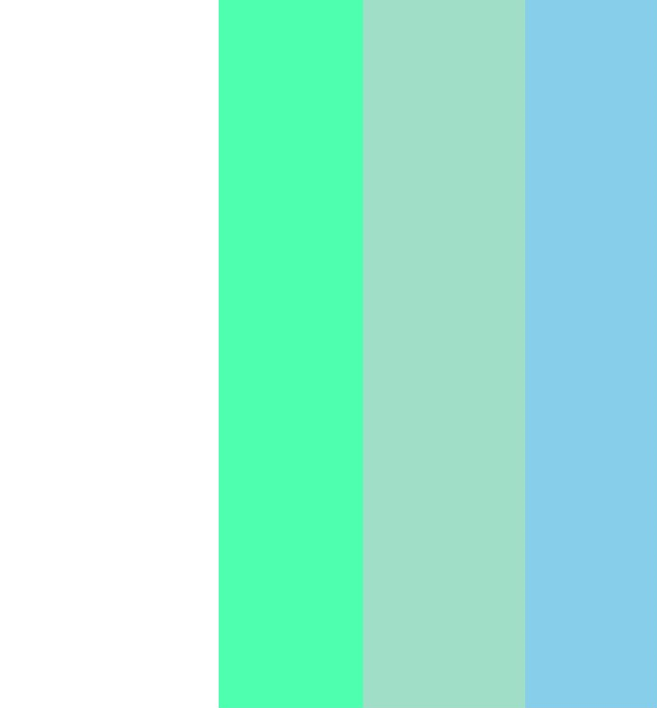
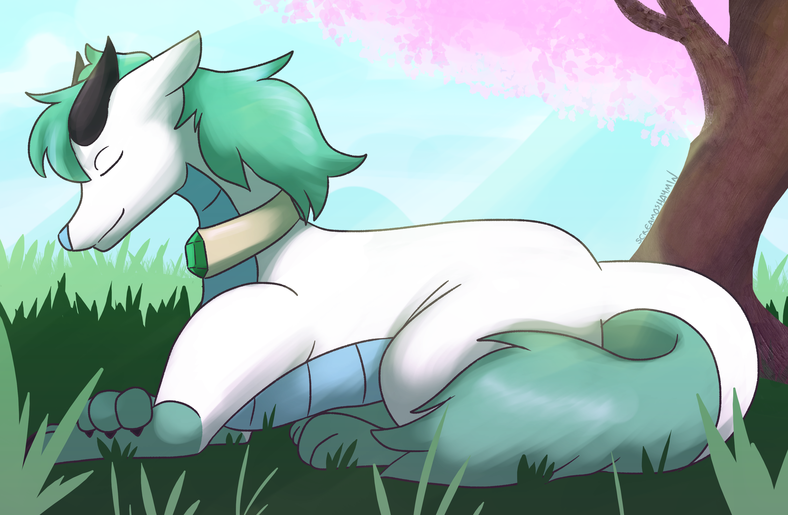
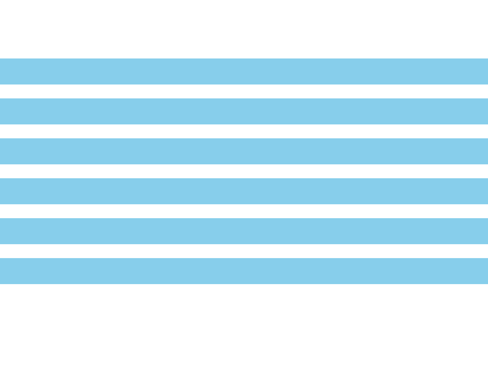

<h2>Conceptualization</h2>

I came up with the idea of creating an art blog in January 2024. Around the start of the year I was struggling with art block and feared that I wasn't able to draw as well as I wanted to. My goal was to try do at least one drawing per week and then put them on a blog so I could analyze them and observe my progress.

<h2>Researching</h2>

Initially, I planned for the blog to be made entirely using HTML and CSS. When I discussed the initial ideas with my lecturers, they felt that HTML on its own wasn't unique enough for a blog and suggested I look into different frameworks and software. One that stood out to me was Jekyll, a static site generator used for creating blogs. Jekyll hosts websites via GitHub Pages, which I have used previously. 

I looked at several different websites to get an idea of how my website would look. Most of these sites focused on art or were blogs, so they fitted the scope of my project. Listed below are the sites that I used as inspiration for my project.

<ul class="makingof-ol">
     <li>
        <a href="https://www.artstation.com">ArtStation</a>
    </li>
    <li>
        <a href="https://www.tumblr.com">Tumblr</a>
    </li>
    <li>
        <a href="https://www.deviantart.com">DeviantArt</a>
    </li>
    <li>
        <a href="https://www.mastafran.com">Mastafran - The Art Of Ryan Francis</a>
    </li>
</ul>

<h2>Designing</h2>

I wanted my blog's design to be simple yet stand out by having a distinct color scheme and font. For the color scheme, I went with white, light green and sky blue, as these shades pair well together. I used the palette below, though I adjusted some of the colors to be more visible and harmonize better with the website.

I used the W3Schools website's tutorials to create some elements of the website, such as the horizontal navbar and the banner image. I initially wanted to draw my character as the banner image, but I felt a real drawing would not harmonize with the website. However, I had a commission made a year ago that I felt worked as a banner, so I used it with permission from my supervisor. I cropped the image to make it compatible as a banner for my site.

For the fonts, I went on Google Fonts to look for a font that looked modern and aesthetically pleasing. I went with sans-serif because I felt serif fonts looked too complex and archaic for my website design. I went with the Montserrat font, as it has a thin, modern design that stands out for headings.

One idea I initially had while designing the blog was a geometrical background or frame over translucent text. I initially designed a horizontal striped background for this idea, but found that it was too difficult to make compatible with the site, alongside being visually unappealing. 

<h2>Coding</h2>

To make Jekyll work on my blog, I installed Ruby, an object-oriented language used by Jekyll. HTML pages in Jekyll work differently than normally - the contents of a page are written in Markdown, a markup language used for blogging software, instead of on a HTML page. The contents are then put onto a layout page.

For my site, I had three layouts - the feed for my blog posts, the layout of my blog posts, and the layout for the site's pages. The latter contained included elements such as the banner, navbar, header and footer. My site used a single CSS stylesheet that was shared by each page. I linked the Montserrat font I used, as it is more efficient than downloading the font's files onto a computer. 

I regularly uploaded my changes using Git Bash and hosted the site locally to check my work. By the time it was finished, I already had it hosted on GitHub Pages. Hosting it locally is convenient in the case that I want to present it but am unable to access the site.